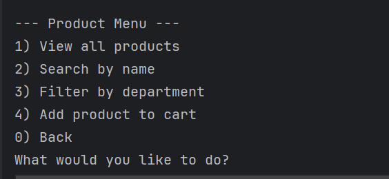
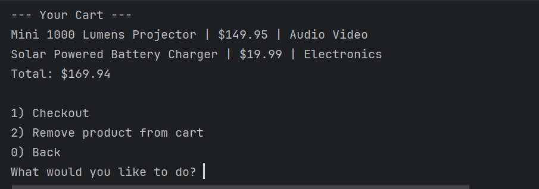
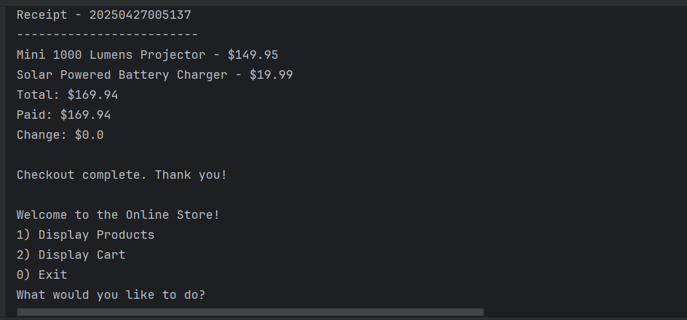

# 🛒 Online Store CLI Application

This is a simple Java console application that simulates an online store.  
Users can view products, search or filter products, add items to a shopping cart, and complete checkout by paying and receiving a receipt.

---

## 📋 Features

- View all available products
- Search products by name
- Filter products by department
- Add products to shopping cart
- View and manage cart (checkout, remove items)
- Calculate total price and change
- Print and save receipt to a text file
- Organized menu system using Java CLI

---

## 🛠️ Technologies Used

- Java (JDK 17+)
- ArrayList for managing inventory and cart
- File I/O (`BufferedReader`, `Files`) for loading products and saving receipts
- Simple Scanner-based menu navigation

---

## 📂 Project Structure


---

## 📸 Screenshots


### 🏠 Main Menu


### 🛒 Cart View


### 💵 Checkout Receipt



---

## 💬 Interesting Piece of Code

Example of receipt creation and saving:

```java
StringBuilder receipt = new StringBuilder();
String timeStamp = LocalDateTime.now().format(DateTimeFormatter.ofPattern("yyyyMMddHHmmss"));
receipt.append("Receipt - ").append(timeStamp).append("\n");
receipt.append("-------------------------\n");

for (Product product : cart) {
    receipt.append(product.getName()).append(" - $").append(product.getPrice()).append("\n");
}

receipt.append("Total: $").append(total).append("\n");
receipt.append("Paid: $").append(paid).append("\n");
receipt.append("Change: $").append(change).append("\n");

Files.createDirectories(Paths.get("Receipts"));
Files.write(Paths.get("Receipts/" + timeStamp + ".txt"), receipt.toString().getBytes());


## 🏆 Author

- **Thierno Diallo**
